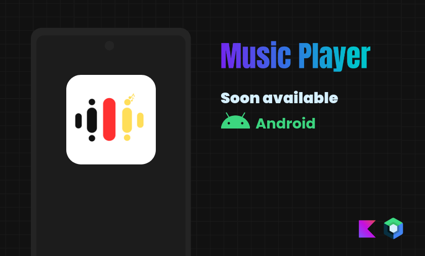

    <h1>Lied Music Player</h1>
    
    
    
    
Offline music player, developed using Jetack Compose

    

## Architecture
This project follows the **MVI** architecture pattern to separate concerns and promote modularity.
- State Management: ViewModels manage UI states efficiently, ensuring responsive and clean UI updates.
- Separation of Concerns: Clear distinction between UI logic, business logic, and data layers.
- Dependency Injection: **Koin** handles dependencies across the app, making it easier to test and manage.
